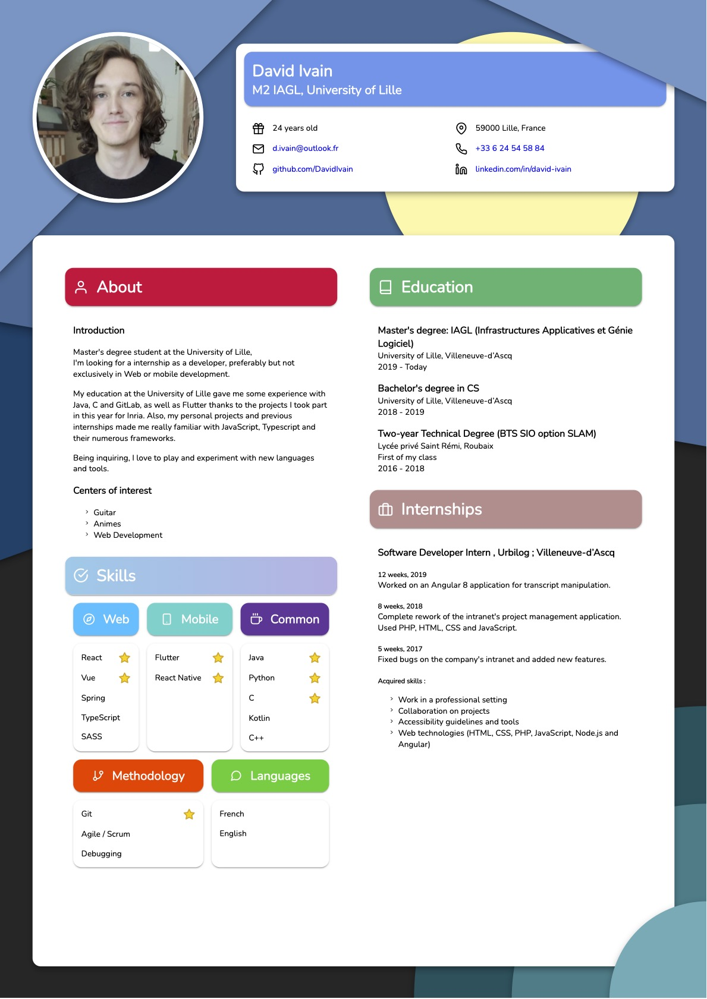

# Resume (WIP)

Word processors are not exactly my strong point, so I made my resume using Vue.js, Typescript and scss.<br/>
That way, I can also reuse it for my online portfolio.

I render the page in a Browser and use "print to pdf".



## Project setup
```
yarn install
```

### Compiles and hot-reloads for development
```
yarn serve
```

### Compiles and minifies for production
```
yarn build
```

### Lints and fixes files
```
yarn lint
```

### Customize configuration
See [Configuration Reference](https://cli.vuejs.org/config/).
